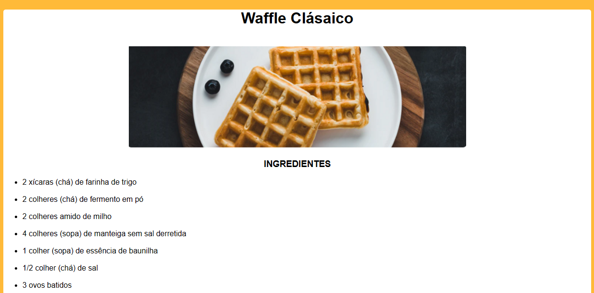

<h1 align="center"> 🧇 Página de receitas 🧇</h1>

Uma página web de uma receita com título, imagem, lista de ingredientes e modo de preparo.

 

  

## 💻 Tecnologias

Esse projeto foi desenvolvido com as seguintes tecnologias:

- HTML
- CSS
- Git 
- Github

## Projeto

Este projeto foi retirado de um dos desafios Discover, da plataforma Rocketseat.
